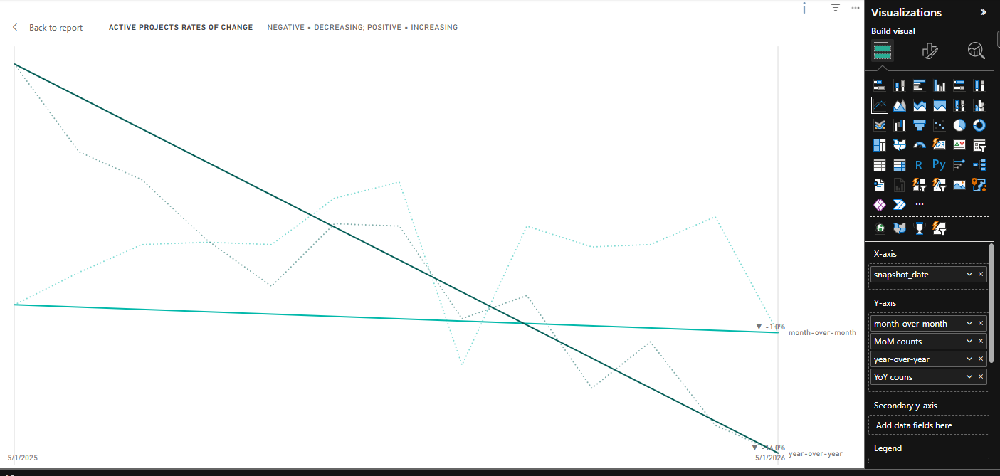

## Introduction

The Active Projects Rate‑of‑Change visual shows how the number of active projects on each platform moves month‑over‑month (MoM) and year‑over‑year (YoY). The underlying DAX measures calculate the difference between the current snapshot and the previous month or the same month in the prior year, then the graph displays only the first and last points of the selected date range so the trend is easy to read.



## Calculations and Measures
Together, the MoM and YoY perspectives give a concise, data‑driven story of project activity dynamics, helping teams quickly assess performance and prioritize actions.
</br>

<details>
  <summary>The MoM change (c_active_proj_mom_difference) calculation captures the short‑term swing in active projects, highlighting recent gains or drops that may be tied to releases, sprint cycles, or seasonal usage.</summary>
  </br>

```dax
c_active_proj_mom_difference = 
    VAR thisplatform = AtlassianMetrics_pivot[platform]
    VAR prevdatetime = DATEADD(AtlassianMetrics_pivot[snapshot_date], -1, MONTH)
    VAR prevvalue = 
    CALCULATE(
        MAX(AtlassianMetrics_pivot[total_active_project_count])
        ,filter(all(AtlassianMetrics_pivot), AtlassianMetrics_pivot[platform]=thisplatform 
        && AtlassianMetrics_pivot[snapshot_date]=prevdatetime)
        )
    var difference = AtlassianMetrics_pivot[total_active_project_count] - prevvalue
    RETURN
    if(isblank(prevvalue), blank(), difference)
```
</details>
<br>
<details>
  <summary>YoY change (c_active_proj_yoy_difference) calcuation surfaces longer‑term shifts, letting stakeholders see whether growth is sustained across years or if there’s a regression after a previous peak.</summary>
  </br>

```dax
c_active_proj_yoy_difference = 
    VAR thisplatform = AtlassianMetrics_pivot[platform]
    VAR prevdatetime = DATEADD(AtlassianMetrics_pivot[snapshot_date], -12, MONTH)
    VAR prevvalue = 
    CALCULATE(
        MAX(AtlassianMetrics_pivot[total_active_project_count])
        ,filter(all(AtlassianMetrics_pivot), AtlassianMetrics_pivot[platform]=thisplatform 
        && AtlassianMetrics_pivot[snapshot_date]=prevdatetime)
        )
    var difference = AtlassianMetrics_pivot[total_active_project_count] - prevvalue
    RETURN
    if(isblank(prevvalue), blank(), difference)
```
</details>
</br>
<details>
  <summary>The visual plots these differences for the selected platform, using the measures m_active_proj_mom_graph and m_active_proj_yoy_graph. By showing only the first and last snapshot values, the chart emphasizes the overall direction of the trend while keeping the display uncluttered.</summary>
  </br>

```dax
m_active_proj_mom_graph = 
    VAR FirstYear = [m_min_selected_snapshot]
    VAR LastYear = [m_max_selected_snapshot]
    RETURN
        IF(
            SELECTEDVALUE(AtlassianMetrics_pivot[snapshot_date]) = FirstYear 
            || SELECTEDVALUE(AtlassianMetrics_pivot[snapshot_date]) = LastYear,
            SUM(AtlassianMetrics_pivot[c_active_proj_mom_difference]),
            BLANK()
        )
    
m_active_proj_yoy_graph = 
    VAR FirstYear = [m_min_selected_snapshot]
    VAR LastYear = [m_max_selected_snapshot]
    RETURN
        IF(
            SELECTEDVALUE(AtlassianMetrics_pivot[snapshot_date]) = FirstYear 
            || SELECTEDVALUE(AtlassianMetrics_pivot[snapshot_date]) = LastYear,
            SUM(AtlassianMetrics_pivot[c_active_proj_yoy_difference]),
            BLANK()
        )
```
</details>
